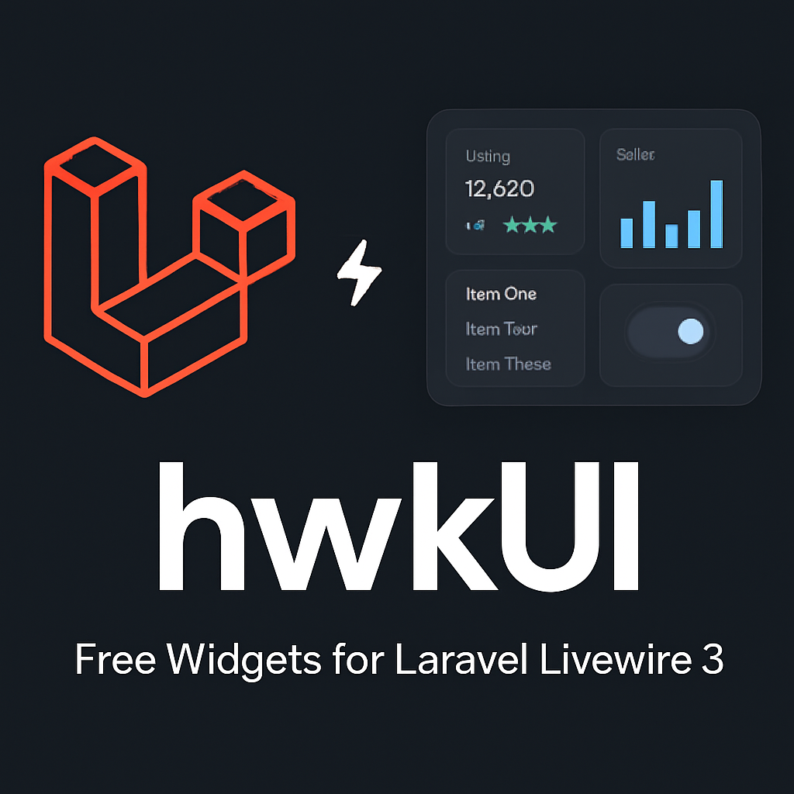
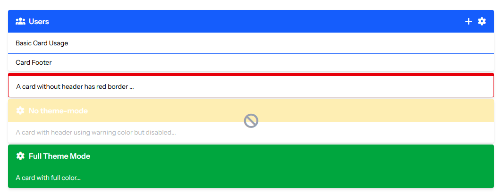
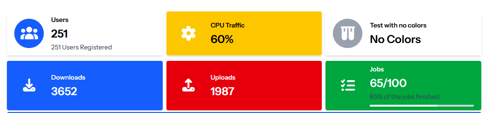

# hwkUI



[](https://packagist.org/packages/hawkiq/hwkui)

**hwkUI** is a Laravel package providing ready-to-use UI widgets built on top of **Livewire 3**, designed for simplicity and flexibility. It includes dynamic Select2 , Datetimepicker and DataTable components and more coming soon.

# 📦 Requirements

- Laravel **10.x**
- Livewire **3.x**
- PHP **8.1+**

> ⚠️ This package does **not** auto-install `select2/select2`. It loads assets via CDN by default, but you can switch to **local assets** easily (see below).

---

# 🚀 Installation

```bash
composer require hawkiq/hwkui
```

## 🚀 Update

```bash
composer update hawkiq/hwkui
```

# ⚙️ Configuration
The config file `config/hwkui.php` defines which JS/CSS plugins to load and whether to use CDN or local assets.

### 1. Publish the Config File

```bash
php artisan vendor:publish --tag=hwkui-config
```

This will create `config/hwkui.php`.

## 🌐 Using CDN (Default)
By default, hwkUI uses CDN links for plugins like jQuery, Select2, and DataTables.

Example from `config/hwkui.php`:

```php
'Select2' => [
    'active' => true,
    'files' => [
        [
            'type' => 'css',
            'asset' => false,
            'location' => '//cdnjs.cloudflare.com/ajax/libs/select2/4.0.13/css/select2.min.css',
        ],
        [
            'type' => 'js',
            'asset' => false,
            'location' => '//cdnjs.cloudflare.com/ajax/libs/select2/4.0.13/js/select2.min.js',
        ],
    ],
],

```

## 🗂️ Using Local Assets (Optional)

If you prefer to serve local assets (for offline use or better performance), follow these steps:
### Step 1: Download Required JS/CSS Files

You must download the files manually:

    jQuery: https://code.jquery.com/jquery-3.7.1.min.js

    Select2:

        CSS: https://cdnjs.cloudflare.com/ajax/libs/select2/4.0.13/css/select2.min.css

        JS: https://cdnjs.cloudflare.com/ajax/libs/select2/4.0.13/js/select2.min.js

    Place them under `public/vendor/hwkui/` or another folder of your choice.

### Step 2: Update config/hwkui.php

Change asset => true and point to your local file path:

```php
'Select2' => [
    'active' => true,
    'files' => [
        [
            'type' => 'css',
            'asset' => true,
            'location' => 'vendor/hwkui/select2.min.css',
        ],
        [
            'type' => 'js',
            'asset' => true,
            'location' => 'vendor/hwkui/select2.min.js',
        ],
    ],
],

```

Laravel will generate the full asset URL using `asset('vendor/hwkui/select2.min.css')`.

## 🧩 Usage

# Select2 Component

In your Blade view:

```blade
 <x-hwkui-select wire:model="selectedItem" label="Select User to PLay" placeholder="Select a user Babe">
            @forelse ($users as $user)
                <option wire:key="{{ $user->id }}" value="{{ $user->name }}">{{ $user->name }}</option>
            @empty
                <option value="">No options available</option>
            @endforelse
        </x-hwkui-select>

```
Make sure to include Livewire and the component's scripts on your page.

you can pass options for Select2 like via component

```blade
<x-hwkui-select
    wire:model="selectedUser"
    label="Choose User"
    :options="$options" 
>
</x-hwkui-select>

```

or direct array

```blade
<x-hwkui-select
    wire:model="selectedUser"
    label="Choose User"
    :options="[
         'placeholder' => 'Select an option',
        'allowClear' => true,
        'multiple' => true,
    ]" 
>
</x-hwkui-select>

```

# 🗓️ DateTime Picker Component

This component provides an elegant datetime picker powered by Tempus Dominus v6, ready to use in your Laravel Livewire app with a clean, customizable Blade syntax.

Enable in Configuration

```php
'Datetime' => [
            'active' => true,
            'files' => [
                [
                    'type' => 'css',
                    'asset' => false,
                    'location' => '//cdn.jsdelivr.net/npm/@eonasdan/tempus-dominus@6.9.4/dist/css/tempus-dominus.min.css',
                ],
                [
                    'type' => 'js',
                    'asset' => false,
                    'defer' => true,
                    'location' => '//cdn.jsdelivr.net/npm/@popperjs/core@2.11.6/dist/umd/popper.min.js',
                ],
                [
                    'type' => 'js',
                    'asset' => false,
                    'defer' => true,
                    'location' => '//cdn.jsdelivr.net/npm/@eonasdan/tempus-dominus@6.9.4/dist/js/tempus-dominus.min.js',
                ],
            ],
        ],
```

in your blade use it like this

## ✅ Basic Usage

```blade

 <x-hwkui-datetime id="test-datetime" label="Test DateTime"
        placeholder="Select Date" wire:model="setDatetime" />

```

🛠️ You can configure default picker options globally in  `config/hwkui.php`

```php

'datetime' => [
        'defaultOptions' => [
            'display' => [
                'viewMode' => 'calendar',
                'components' => [
                    'calendar' => true,
                    'date' => true,
                    'year' => true,
                    'month' => true,
                    'clock' => true,
                ],
                'calendarWeeks' => false,
            ],
            'debug' => false,
            'useCurrent' => true,
            'stepping' => 1,
            'localization' => [
                'format' => 'yyyy-MM-dd hh:mm',
                'locale' => app()->getLocale(),
            ],
        ],
    ],


```

You can explore all available options on the  [Options page](https://getdatepicker.com/6/options/) and see what you can add.

## ✏️ Override Options Per Component

yOverride settings for individual instances using the `:options`  attribute:

```blade

 <x-hwkui-datetime id="test-datetime" :options="[
        'display' => [
            'components' => [
                'date' => false,
                'year' => true,
                'month' => true,
                'clock' => false,
            ],
        ],
        'localization' => [
            'format' => 'yyyy-MM h:i:s',
            'locale' => app()->getLocale(),
        ],
    ]" class="border-amber-500" label="Test DateTime"
        placeholder="Select Date" wire:model="setDatetime" />

```

# ✒️ Text Editor Component

A rich-text editor component powered by Quill.js, built for Laravel Livewire 3. Fully supports customization, toolbar control, themes, and Livewire model binding.
In your `config/hwkui.php`, activate the editor plugin:

```php

'plugins' => [
    'Editor' => [
        'active' => true,
        'files' => [
            [
                'type' => 'css',
                'asset' => false,
                'location' => '//cdn.quilljs.com/1.3.6/quill.snow.css',
            ],
            [
                'type' => 'js',
                'asset' => false,
                'location' => '//cdn.quilljs.com/1.3.6/quill.min.js',
            ],
        ],
    ],
],


```

## ✅ Basic Usage

```blade
<x-hwkui-editor id="editor" wire:model="content">
    Default content goes here...
</x-hwkui-editor>
```
## 🛠 Toolbar Customization
Use the toolbar attribute to define your desired tools.

```blade

<x-hwkui-editor id="editor"
    wire:model.live="content"
    theme="snow"
    toolbar="bold|italic|underline|link|image|code-block|blockquote|list|clean">
</x-hwkui-editor>


```
🔹 You can customize the toolbar using Quill toolbar options separated by |.


# 📦 Card Widget
A reusable friendly Card component built with Tailwind CSS v4, part of the hawkiq/hwkui widget library. It supports theme colors, outline and solid styles, optional icons, header tools, footer, and dark mode.



## ✅ Basic Usage

```blade
    <x-hwkui-card title="Users" icon="fas fa-users" theme="primary">
        Basic Card Usage

        <x-slot name="tools">
            <button class="cursor-pointer text-white hover:text-gray-200">
                <i class="fas fa-plus"></i>
            </button>
            <button class="cursor-pointer text-white hover:text-gray-200">
                <i class="fas fa-cog"></i>
            </button>
        </x-slot>
        <x-slot name="footer">
            Card Footer
        </x-slot>
    </x-hwkui-card>


    <x-hwkui-card theme="danger" theme-mode="outline">
        A card without header has red border ...
    </x-hwkui-card>

    <x-hwkui-card icon="fas fa-cog" title="No theme-mode" theme="warning" disabled>
        A card with header using warning color but disabled...
    </x-hwkui-card>

    <x-hwkui-card icon="fas fa-cog" title="Full Theme Mode" theme="success" theme-mode="full">
        A card with full color...
    </x-hwkui-card>

```

# 📦 Info Box Widget
For display small infos with icons or progress bar


## ✅ Basic Usage

```blade
    <x-hwkui-info-box title="Users" text="251" icon="fas fa-users" iconTheme="primary"
        description="251 Users Registered" url="https://osama.app" urlTarget="_blank" />

    <x-hwkui-info-box title="CPU Traffic" text="60%" icon="fas fa-cog" theme="warning" iconTheme="warning" />

    <x-hwkui-info-box title="Test with no colors" text="No Colors" icon="fas fa-vials" />

    <x-hwkui-info-box title="Downloads" text="3652" icon="fas fa-download" theme="primary" iconTheme="primary" />

    <x-hwkui-info-box title="Uploads" text="1987" icon="fas fa-upload" theme="danger" iconTheme="danger" />
    
    <x-hwkui-info-box title="Jobs" text="65/100" description="65% of the jobs finished" icon="fas fa-tasks"
        theme="success" iconTheme="success" progress="65" />

```


# 🧪 Testing

Run:
```bash
php artisan serve
```
Then visit your Livewire component using hwkUI widgets. All assets should be loaded either via CDN or local as per your config.

# 🔧 Customization

Feel free to extend or publish views if needed:

```bash
php artisan vendor:publish --tag=hwkui-views
```

# 📝 License

This project is open-sourced under the MIT license.

# 👤 Author

hawkiq

Enjoy building awesome interfaces with hwkUI! 🚀
