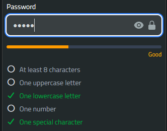

# 🧩 Components

## 🧩 TomSelect

This component replaces Select2.js with a vanilla JS alternative, so it does not depend on jQuery.

- Install

!!! note "Use either CDN method or npm which described in [Configuration](configuration.md) page."

I'll use modern and prefered way in this tutorial .

```bash
npm install tom-select
```

Then, in your `app.js` import the packages:

```js title="app.js" linenums="1"
import "tom-select/dist/css/tom-select.css";
import TomSelect from "tom-select";
window.TomSelect = TomSelect;
```

- Basic Usage

```html
<x-hwkui-tom-select
  class="h-full"
  wire:model="customer_id"
  label="Customer"
  placeholder="Select customer..."
>
  <!-- Default empty option -->
  <option value="">Select Customer...</option>

  <!-- Dynamic options -->
  @foreach ($customers as $c)
  <option value="{{ (string) $c->id }}" wire:key="{{ $c->id }}">
    {{ $c->name }}
  </option>
  @endforeach
</x-hwkui-tom-select>
```

- Passing Additional TomSelect Options

You can pass extra options via the `:options` attribute:

```html
<x-hwkui-tom-select
  wire:model="customer_id"
  label="Customer"
  :options="[
        'maxItems' => 3,
        'create' => true,
        'plugins' => ['remove_button']
    ]"
>
</x-hwkui-tom-select>
```

More information about TomSelect setup can be found at the official website [Tom Select](https://tom-select.js.org/)

---

## 🧩 FlatPicker ( DateTime picker )

This component provides an elegant datetime picker powered by FlatPickr, ready to use in your Laravel Livewire app with a clean, customizable Blade syntax.

- Install

!!! note "Use either CDN method or npm which described in [Configuration](configuration.md) page."
I'll use modern and prefered way in this tutorial .

```bash
npm install flatpickr
```

edit `app.js`

```js title="app.js" linenums="1"
import flatpickr from "flatpickr";
import "flatpickr/dist/flatpickr.min.css";
import monthSelectPlugin from "flatpickr/dist/plugins/monthSelect";
import "flatpickr/dist/plugins/monthSelect/style.css";
window.flatpickr = flatpickr;
window.monthSelectPlugin = monthSelectPlugin;
```

- Basic Usage

```html
<x-hwkui-flat-picker
  id="datetimePicker"
  label="Flatpicker"
  placeholder="Select Date"
  wire:model="setDatetime"
/>
```

You can configure default picker options globally in `config/hwkui.php`

```php title="hwkui.php" linenums="1"
<?php

'flat-picker' => [
    'defaultOptions' => [
        'enableTime' => true,
        'dateFormat' => 'Y-m-d H:i',
        'time_24hr' => true,
        'allowInput' => false,
        'altInput' => true,
        'altFormat' => 'Y-m-d H:i',
        'minuteIncrement' => 5,
    ]
],


```

You can explore all available options on the [Options page](https://flatpickr.js.org/options/) and see what you can add.

- Override Options Per Component

to Override settings for individual instances using the `:options` attribute:

```html
<x-hwkui-flat-picker
  id="datetimePicker"
  label="Select Date"
  placeholder="Select Date"
  wire:model="month"
  :options="[
                'enableTime' => false,
                'dateFormat' => 'Y-m',
                'altFormat' => 'Y-m',
            ]"
/>
```

if you want to select only months you must then pass it as `:options` argument

```html
<x-hwkui-flat-picker
  id="datetimePicker"
  label="Select Month"
  placeholder="Select Month"
  wire:model="month"
  :options="[
        'enableTime' => false,
        'dateFormat' => 'Y-m',
        'altFormat' => 'Y-m',
        'plugins' => [
    [
        'type' => 'monthSelect',
        'config' => [
            'shorthand' => true,
            'theme' => 'dark',
        ],
    ],
],
    ]"
/>
```

If you want to use `Year Select` plugin which FlatPicker doesnt provide it directly you must install third party plugin

```bash
npm install @mikesha/flatpickr-year-select-plugin

```

then add it

```js title="app.js" linenums="1"
import yearSelectPlugin from "@mikesha/flatpickr-year-select-plugin";
window.yearSelectPlugin = yearSelectPlugin;
```

```css title="app.css" linenums="1"
@import "../../node_modules/@mikesha/flatpickr-year-select-plugin/build/yearPlugin.css";
```

use it in blade

```html
<x-hwkui-flat-picker
  id="datetimePicker"
  label="Select Year"
  placeholder="Select Year"
  wire:model="year"
  :options="[
        'enableTime' => false,
        'dateFormat' => 'Y',
        'altFormat' => 'Y',
        'plugins' => [
            [
                'type' => 'yearSelect',
            ],
        ],
    ]"
/>
```

---

## 🧩 Drag & Drop File Upload

A premium, accessible, and reactive file upload component designed for Laravel, Livewire, and Tailwind CSS. It supports drag-and-drop mechanics, real-time client-side max file limitations, progress indication bars, and inline image/document previews.

---

!!! note "No setup is required since its depends on AlpineJs which comes with Livewire."

- Basic Usage

```html
<x-hwkui-upload wire:model="avatar" preview />
```

```html
<!-- Multiple Files with Previews & Constraints -->
<x-hwkui-upload
  wire:model="documents"
  multiple
  max="3"
  accept="image/*,.pdf"
  hint="Only images or PDFs are allowed. Max 3 files."
/>
```

- Component API

| Attribute    | Type      | Default    | Description                                                                                    |
| :----------- | :-------- | :--------- | :--------------------------------------------------------------------------------------------- | ------------------------------------------------------------------------ |
| `wire:model` | `string`  | `Required` | The backing Livewire public property array/file handler string name.                           |
| `multiple`   | `boolean` | `false`    | Enables selection or dragging of multiple files simultaneously.                                |
| `max`        | `integer` | `null`     | Imposes client-side file count safety validations (works exclusively with multiple).           |
| `preview`    | `boolean` | `false`    | Renders dynamic thumbnail galleries for images or itemized layout lists for non-images.        |
| `hint`       | `string   | null`      | `null`                                                                                         | Overrides the default helper sub-text positioned beneath upload prompts. |
| `accept`     | `string`  | `*`        | Valid standard file mime-type constraint filters forwarded directly to native browser dialogs. |

---

## 🧩 Password Strength Indicator

A lightweight, client-side password strength indicator.



| Attribute   | Type      | Default     | Description                                     |
| :---------- | :-------- | :---------- | :---------------------------------------------- |
| `name`      | `string`  | `password`  | The `name` or `wire:model` of the target input. |
| `checklist` | `boolean` | `true`      | Whether to display the list of password rules.  |
| `rules`     | `array`   | (See below) | The specific rules to validate against.         |

- Customizing Rules

By default, the component checks for Length (8), Uppercase, Lowercase, Numbers, and Symbols.

You can override these rules by passing an array. Set a rule to false to disable it entirely (it will be removed from both the UI and the scoring logic). Set length to an integer to define the minimum character count.

```html
<!-- Example: Require only 6 characters and a number -->
<x-hwkui-password-strength
  name="password"
  :rules="[
        'length' => 6, 
        'uppercase' => false, 
        'lowercase' => false, 
        'number' => true, 
        'symbol' => false
    ]"
/>
```

- Basic Usage

Place the `<x-hwkui-password-strength>` component directly below your password input. Ensure the `name` prop matches either the `name` or `wire:model` attribute of the target input.

```html
<flux:field class="mb-4">
  <flux:input wire:model="password" type="password" />
  <!-- Connects to wire:model="password" -->
  <x-hwkui-password-strength name="password" />
</flux:field>
```

---

## 🧩 Select2

- Install

!!! note "Use either CDN method or npm which described in [Configuration](configuration.md) page."
I'll use modern and prefered way in this tutorial .

```bash
npm install jquery select2
```

```js title="app.js" linenums="1"
// For select and jquery component
import $ from "jquery";
import "select2/dist/js/select2.full.min.js";
import "select2/dist/css/select2.min.css";
window.$ = $;
window.jQuery = $;
window.Select2 = $.fn.select2;
```

- Basic usgae

```html
<x-hwkui-select
  wire:model="selectedItem"
  label="Select User to PLay"
  placeholder="Select a user Babe"
>
  @forelse ($users as $user)
  <option wire:key="{{ $user->id }}" value="{{ $user->name }}">
    {{ $user->name }}
  </option>
  @empty
  <option value="">No options available</option>
  @endforelse
</x-hwkui-select>
```

Make sure to include Livewire and the component's scripts on your page.

you can pass options for Select2 like via component

```html
<x-hwkui-select
  wire:model="selectedUser"
  label="Choose User"
  :options="$options"
>
</x-hwkui-select>
```

or direct array

```html
<x-hwkui-select
  wire:model="selectedUser"
  label="Choose User"
  :options="[
         'placeholder' => 'Select an option',
        'allowClear' => true,
        'multiple' => true,
    ]"
>
</x-hwkui-select>
```

## 🧩 DateTime Picker

This component provides an elegant datetime picker powered by Tempus Dominus v6, ready to use in your Laravel Livewire app with a clean, customizable Blade syntax.

!!! danger "Developer might abandoned this Project"
As stated in official website This project is no longer active or supported

- Install

!!! note "Use either CDN method or npm which described in [Configuration](configuration.md) page."
I'll use modern and prefered way in this tutorial .

```bash
npm install @popperjs/core @eonasdan/tempus-dominus
```

```js title="app.js" linenums="1"
// For datetime picker from tempus-dominus ( this is abandond now no new releases)
import * as Popper from "@popperjs/core";
import { TempusDominus } from "@eonasdan/tempus-dominus";
import "@eonasdan/tempus-dominus/dist/css/tempus-dominus.min.css";
window.Popper = Popper;
//use this if you used cdn assets
window.tempusDominus = TempusDominus;
// or use this if you used npm
window.tempusDominus = {
  TempusDominus,
};
```

- Basic Usage

```html
<x-hwkui-datetime
  id="test-datetime"
  label="Test DateTime"
  placeholder="Select Date"
  wire:model="setDatetime"
/>
```

You can configure default picker options globally in `config/hwkui.php`

```php title="hwkui.php" linenums="1"
<?php


'datetime' => [
        'defaultOptions' => [
            'display' => [
                'viewMode' => 'calendar',
                'components' => [
                    'calendar' => true,
                    'date' => true,
                    'year' => true,
                    'month' => true,
                    'clock' => true,
                ],
                'calendarWeeks' => false,
            ],
            'debug' => false,
            'useCurrent' => true,
            'stepping' => 1,
            'localization' => [
                'format' => 'yyyy-MM-dd hh:mm',
                'locale' => app()->getLocale(),
            ],
        ],
    ],


```

You can explore all available options on the [Options page](https://getdatepicker.com/6/options/) and see what you can add.

- Override Options Per Component

Override settings for individual instances using the `:options` attribute:

```html
<x-hwkui-datetime
  id="test-datetime"
  :options="[
        'display' => [
            'components' => [
                'date' => false,
                'year' => true,
                'month' => true,
                'clock' => false,
            ],
        ],
        'localization' => [
            'format' => 'yyyy-MM h:i:s',
            'locale' => app()->getLocale(),
        ],
    ]"
  class="border-amber-500"
  label="Test DateTime"
  placeholder="Select Date"
  wire:model="setDatetime"
/>
```

## 🧩 Jodit Text Editor

Lightweight Blade component powered by Jodit Rich Text Editor, Alpine.js, and Livewire. It features built-in support for two-way data binding, custom toolbar profiles, file/image uploading, and read-only states.

- Install

!!! note "Use either CDN method or npm which described in [Configuration](configuration.md) page."

I'll use modern and prefered way in this tutorial .

```bash
npm install jodit
```

Then, in your `app.js` import the packages:

```js title="app.js" linenums="1"
import "jodit/esm/plugins/resizer/resizer"; // Resizer plugin is used when inserting images
import "jodit/esm/plugins/video/video"; // Video plugin is used to insert videos
import "jodit/esm/plugins/clean-html/clean-html"; // Clean HTML plugin is used to clean the HTML content

import { Jodit } from "jodit";

window.Jodit = Jodit;

```

```css title="app.css" linenums="1"
@import "jodit/es2021/jodit";
```

- Component API

You can customize the editor instance using the following properties:

| Prop | Type | Default | Description |
| --- | --- | --- | --- |
| `id` | `string` | Auto-generated (`jodit-{hash}`) | Unique HTML ID for the textarea.|
| `profile` | `string` | `'simple'` (or config default) | Toolbar layout profile (`full`, `simple`, `minimal`).|
| `height` | `integer` | `null` (uses config default: `350`) | Height of the editor in pixels.|
| `placeholder` | `string` | `null` | Placeholder text when the editor is empty.|
| `language` | `string` | `null` (falls back to config) | UI language code (e.g., `'en'`, `'ar'`, `'fr'`).|
| `file-browser` | `boolean` | `false` | Enables file browser and uploader integrations.|
| `connector-url` | `string` | `null` | Custom route name for asset/file uploading handlers.|
| `disabled` | `boolean` | `false` | Sets the editor to read-only mode.|
| `options` | `array` | `[]` | Raw array of custom Jodit configuration options.|

---


- Basic Usage


```html
<x-hwkui-editor wire:model="content" />

```

---


- Advanced Examples

- 1. Using Profiles and Custom Height

Choose from pre-defined toolbar profiles (`full`, `simple`, `minimal`) and set a fixed height:

```html
<x-hwkui-editor wire:model="bio" profile="full" :height="500" placeholder="Write your biography here..." />

```

- 2. Read-Only / Disabled State

You can dynamically bind or statically set the disabled state:

```html
<x-hwkui-editor wire:model="lockedContent" :disabled="true" />

```

- 3. File Browser & Uploader Integration

Enable file and image uploads directly within the editor interface:

```html
<x-hwkui-editor wire:model="postContent" :file-browser="true" />

```

- 4. Passing Custom Jodit Options

Pass extra configuration settings straight into the underlying Jodit instance:

```html
<x-hwkui-editor wire:model="description" :options="['toolbarAdaptive' => false, 'showWordsCounter' => false]" />

```

---

- JavaScript Hooks & Events

The component triggers custom Alpine / DOM events that allow you to interact with the Jodit instance programmatically:

* **`jodit:before-init`**: Dispatched right before Jodit is initialized. Useful for mutating config options or referencing the `Jodit` class.


* **`jodit:ready`**: Dispatched when the editor has completely loaded. Provides access to the `editor` instance and `Jodit` class.


```javascript
document.addEventListener('jodit:ready', (event) => {
    const { editor, Jodit } = event.detail;
    // Do something with the editor instance
});

```
