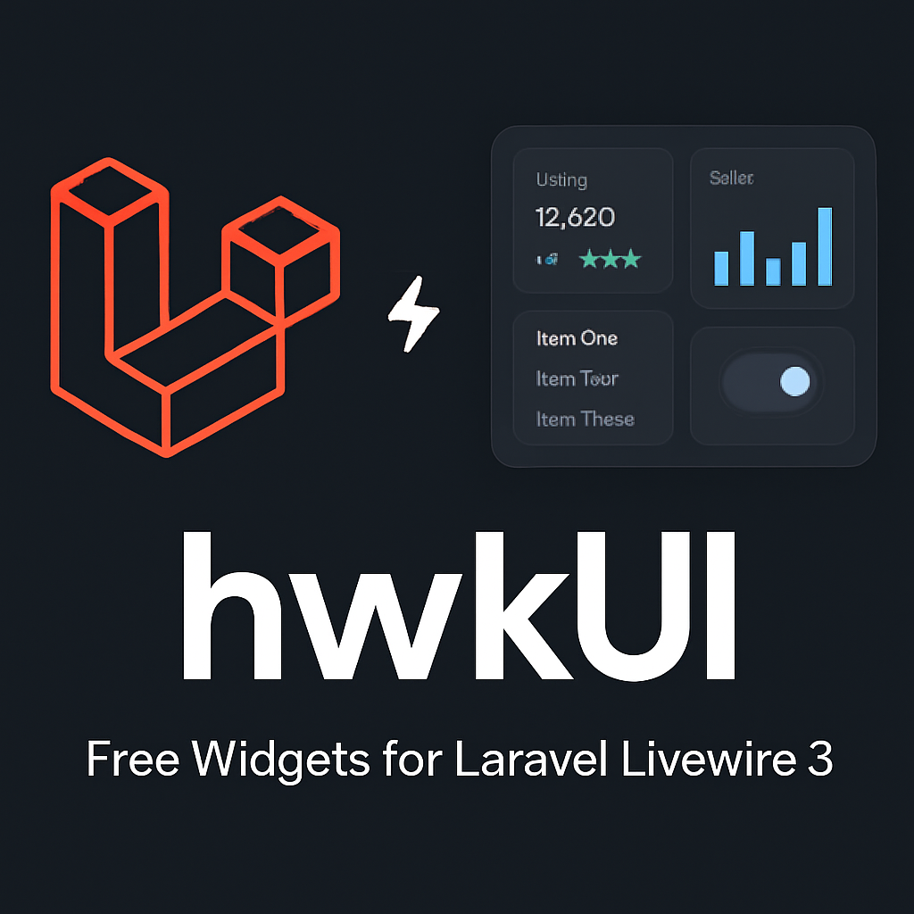

# hwkUI

**hwkUI** is a Laravel package providing ready-to-use UI widgets built on top of **Livewire 3**, designed for simplicity and flexibility. It includes dynamic Select2, Datetimepicker and Rich Text Editor components with easy-to-use components like cards and info boxes.

## 📑 Table of Contents

- [Installation](installation.md)
- [Configuration](configuration.md)
- [Components](components.md)
- [Widgets](widgets.md)
- [Customization](customization.md)
- [License](license.md)
- [Author](author.md)