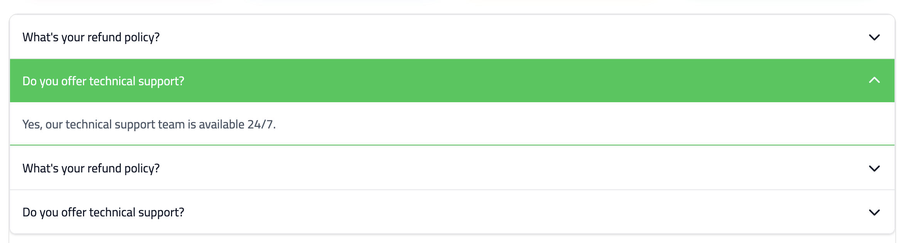
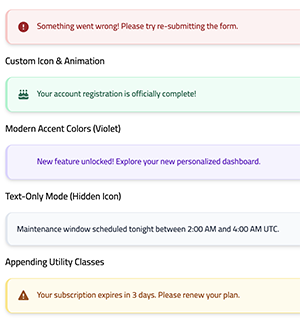
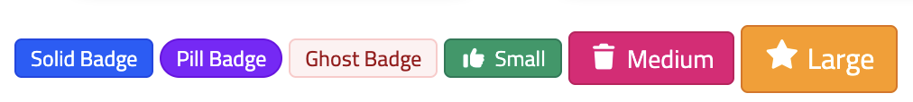
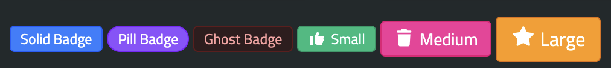
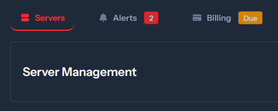
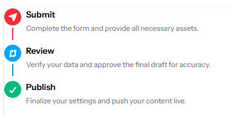

# 🧩 UI Widgets

## 📦 Accordion

Accordion is a modern, professional, and highly interactive UI component designed for Laravel. it offers seamless animations, themeable colors, and flexible configuration options.



- Component API

`<x-hwkui-accordion.group>`

| Attribute | Type | Default | Description |
| :--- | :--- | :--- | :--- |
|`color`|`string`|`primary`|Controls the color theme for all items.|
|`animation`|`string`|`slide`|Options: `slide`, `fade`, `none`.|
|`collapse`|`boolean`|`false`|If true, closes other items when one is opened.|

`<x-hwkui-accordion.item>`

| Attribute | Type | Default | Description |
| :--- | :--- | :--- | :--- |
|`heading`|`string`|`-`|The title displayed in the item header.|
|`icon`|`string`|`chevron-down`|The icon component name to display.|
|`disabled`|`boolean`|`false`|Disables the item interaction.|

- Basic Usage

```html
<x-hwkui-accordion.group color="primary" animation="slide">

    <x-hwkui-accordion.item heading="What is the refund policy?">
        If you are not satisfied with your purchase, we offer a 30-day money-back guarantee.
    </x-hwkui-accordion.item>

    <x-hwkui-accordion.item heading="How do I contact support?" icon="phone">
        Our support team is available 24/7 via email or live chat.
    </x-hwkui-accordion.item>

</x-hwkui-accordion.group>

```

---


## 📦 Alert

A modern, accessible notification banner component designed for Tailwind CSS v4. It supports multiple contextual color themes, customizable embedded icons, smart defaults, and decorative entrance animations.



---

- Component API

| Attribute | Type | Default | Description |
| :--- | :--- | :--- | :--- |
|`color`	|`string`	|`primary`	|Component color theme. Supports: primary, secondary, success, danger, warning, info, violet, pink.|
|`solid`	|`boolean`	|`false`	|Component color theme. Use solid color instead of tone.|
|`icon`	| `string | null`	| `Auto`	|Overrides the contextual default icon. Set to "false" to hide the icon area completely.|
|`animated`	|`boolean | string`	| `false`	| When true, applies an active bounce physics effect to the icon element.|


- Basic Usage


```html
<x-hwkui-alert color="danger">
    Something went wrong! Please try re-submitting the form.
</x-hwkui-alert>

Custom Icon & Animation

<x-hwkui-alert color="success" icon="cake-candles" animated="true">
    Your account registration is officially complete!
</x-hwkui-alert>

Modern Accent Colors (Violet)

<x-hwkui-alert color="violet" icon="sparkles">
    New feature unlocked! Explore your new personalized dashboard.
</x-hwkui-alert>

Text-Only Mode (Hidden Icon)

<x-hwkui-alert color="secondary" icon="false">
    Maintenance window scheduled tonight between 2:00 AM and 4:00 AM UTC.
</x-hwkui-alert>

Appending Utility Classes

<x-hwkui-alert color="warning" class="my-6 shadow-md border-dashed">
    Your subscription expires in 3 days. Please renew your plan.
</x-hwkui-alert>

```

---

## 📦 Badge

The Badge component is a flexible, highly customizable widget used to highlight statuses, counts, labels, or indicators. It supports multiple shape variants, built-in color themes (with full dark mode support), multiple sizing options, and automated icon prefix injection.





---


- Component API

| Attribute | Type | Default | Allowed Values | Description |
| :--- | :--- | :--- | :--- | :--- |
|`variant`|`string`|`solid`|`solid  | ghost  | pill`|Defines the background/border style of the badge.|
|`color`|`string`,|`primary`|`primary, secondary, success, emerald, danger, warning, info, violet, pink, dark, light`|Sets the visual theme color (supports dark mode out-of-the-box).|
|`size`|`string`|`sm`|`sm  | md  | lg`|Modifies the font-size, padding, and internal icon scaling.|
|`icon`|`string`|`null`|Font Awesome icon name (e.g., `bell`, `star`, `check`)|Automatically prepends the <x-hwkui-icon> component inside the badge.|

---

- Basic Usage

```html
<x-hwkui-badge variant="solid" color="primary">Solid Badge</x-hwkui-badge>

<x-hwkui-badge variant="pill" color="violet">Pill Badge</x-hwkui-badge>

<x-hwkui-badge variant="ghost" color="pink">Ghost Badge</x-hwkui-badge>

<x-hwkui-badge size="sm" icon="star">Small</x-hwkui-badge>

<x-hwkui-badge size="md" icon="star">Medium</x-hwkui-badge>

<x-hwkui-badge size="lg" icon="star">Large</x-hwkui-badge>


```

---


## 📦 Card
A reusable friendly Card component built with Tailwind CSS v4, part of the hawkiq/hwkui widget library. It supports theme colors, outline and solid styles, optional icons, header tools, footer, and dark mode.


- Basic Usage

```html
    <x-hwkui-card title="Users" icon="users" theme="primary">
        Basic Card Usage

        <x-slot name="tools">
            <button class="cursor-pointer text-white hover:text-gray-200">
                <x-hwkui-icon name="plus"></x-hwkui-icon>
            </button>
            <button class="cursor-pointer text-white hover:text-gray-200">
                <x-hwkui-icon name="cog"></x-hwkui-icon>
            </button>
        </x-slot>
        <x-slot name="footer">
            Card Footer
        </x-slot>
    </x-hwkui-card>


    <x-hwkui-card theme="danger" theme-mode="outline">
        A card without header has red border ...
    </x-hwkui-card>

    <x-hwkui-card icon="cog" title="No theme-mode" theme="warning" disabled>
        A card with header using warning color but disabled...
    </x-hwkui-card>

    <x-hwkui-card icon="cog" title="Full Theme Mode" theme="success" theme-mode="full">
        A card with full color...
    </x-hwkui-card>

```

---

## 📦 Carousel

A lightweight, Alpine.js-powered carousel component for Laravel, designed for smooth, high-performance slide transitions without the need for heavy external JavaScript dependencies.

- Basic Usage

```html
<x-hwkui-carousel.wrapper :items="$featured" interval="7000">
    @foreach ($featured as $i => $campaign)
        <x-hwkui-carousel.item :index="$i">
            <h1>{{ $campaign->title }}</h1>
        </x-hwkui-carousel.item>
    @endforeach
</x-hwkui-carousel.wrapper>
```

- Component API

`<x-hwkui-carousel.wrapper>`

| Attribute | Type | Default | Description |
| :--- | :--- | :--- | :--- |
|`items`|`Collection`|`Required`|The collection of data to iterate over.|
|`interval`|`Integer`|`5000`|Time in milliseconds between auto-slides.|

`<x-hwkui-carousel.item>`

| Attribute | Type | Default | Description |
| :--- | :--- | :--- | :--- |
|`index`|`Integer`|`Required`|The current index of the item (usually passed from the loop `$i`).|

---

## 📦 Flip Card


This component provides a smooth 3D flip animation. It supports both click and hover triggers and allows for custom heights.


- Component API

| Attribute | Type | Default | Description |
| :--- | :--- | :--- | :--- |
|`trigger`|`string`|`hover`|Defines the trigger event: `hover` or `click`.|
|`height`|`string`|`300`|The height of the card. Accepts pixels (300px), rems (20rem), etc.|


- Basic usage


```html
    <x-hwkui-flip-card trigger="click" class="max-w-xs">
        <x-slot:front>
            <div class="flex flex-1 flex-col items-center justify-center gap-2 text-center text-zinc-900 dark:text-zinc-200 dark:bg-zinc-900">
                <x-hwkui-icon name="hand-pointer" class="size-10 text-xl-center" aria-hidden="true" />
                <h3 class="text-lg font-semibold">Tap to reveal</h3>
                <p class="text-muted-foreground text-sm">Click anywhere on the card</p>
            </div>
        </x-slot:front>

        <x-slot:back>
            <div class="flex flex-1 flex-col items-center justify-center gap-2 text-center text-blue-800">
                <x-hwkui-icon name="gift" class="size-8 text-primary" aria-hidden="true" />
                <h3 class="text-lg font-semibold">You found it!</h3>
                <p class="text-muted-foreground text-sm">Click again to flip back</p>
            </div>
        </x-slot:back>
    </x-hwkui-flip-card>

```

---

## 📦 Glass Box
For display small infos with icons with Glass look 


- Basic Usage

```html
     <x-hwkui-glass-box title="Downloads" value="251" icon="download" href="/admin"
            color="blue" />

        <x-hwkui-glass-box title="Products" :value="700" icon="cog" href="/admin" color="emerald" />

        <x-hwkui-glass-box title="Categories" :value="30" icon="list" href="/admin" color="amber" />

```
Supported colors names same as tailwind `(blue-amber-emerald-red-cyan-violet)`

---


## 📦 Icon

The Icon component provides a clean shorthand syntax for rendering `Font Awesome` icons. It automatically handles structural classes, provides simple shorthand flags for icon weights, and seamlessly merges any custom Tailwind utility classes.

---

- Component API

| Attribute | Type | Default | Description |
| :--- | :--- | :--- | :--- |
| `icon` | `string` | *Required* | The name of the Font Awesome icon (e.g., `"user"`, `"github"`). |
| `type` | `string` | `"s"` | The weight/type variant. Accepts shorthands (`s`, `b`, `r`, `l`, `t`, `d`) or full names. |

- Weight Shorthand Matrix

- `s` / `solid` → `fa-solid`
- `b` / `brands` → `fa-brands`
- `r` / `regular` → `fa-regular`
- `l` / `light` → `fa-light`
- `t` / `thin` → `fa-thin`
- `d` / `duotone` → `fa-duotone`

- Basic Usage


```html
<!-- Basic Solid Icon-->
<x-hwkui-icon icon="user" />
```


```html
<!-- Brand Icon with Color Utilities -->
<x-hwkui-icon icon="github" type="b" class="text-gray-900 text-xl" />
```

---


## 📦 Info Box
For display small infos with icons or progress bar


- Basic Usage

```html
    <x-hwkui-info-box title="Users" text="251" icon="users" iconTheme="primary"
        description="251 Users Registered" url="https://osama.app" urlTarget="_blank" />

    <x-hwkui-info-box title="CPU Traffic" text="60%" icon="cog" theme="warning" iconTheme="warning" />

    <x-hwkui-info-box title="Test with no colors" text="No Colors" icon="vials" />

    <x-hwkui-info-box title="Downloads" text="3652" icon="download" theme="primary" iconTheme="primary" />

    <x-hwkui-info-box title="Uploads" text="1987" icon="upload" theme="danger" iconTheme="danger" />

    <x-hwkui-info-box title="Jobs" text="65/100" description="65% of the jobs finished" icon="tasks"
        theme="success" iconTheme="success" progress="65" />

```

---


## 📦 Marquee

This component provides a smooth, customizable, and accessible way to display scrolling content such as logos, badges, or text.

- Compoenent API

| Attribute | Type | Default | Description |
| :--- | :--- | :--- | :--- |
|`direction`|`string`|`left`|Direction of the scroll (`left`, `right`, `up`, `down`).|
|`duration`|`string`|`20s`|The time it takes for one full loop.|
|`gap`|`string`|`1rem`|The space between items in the marquee.|
|`pauseOnHover`|`boolean`|`false`|If set, the animation will pause when the user hovers over the component.|
|`fade`|`boolean`|`false`|Adds a linear gradient mask to the edges to create a smooth fade-in/fade-out effect.|

- Basic Usage

```html

<x-hwkui-marquee direction="right" pauseOnHover duration="10s" fade class="w-full max-w-xl py-1">

    @foreach (['🚀 Fast', '♿ Accessible', '🎨 Themeable', '📦 Copy & own', '🌙 Dark mode'] as $f)
        <x-hwkui-badge class="whitespace-nowrap">{{ $f }}</x-hwkui-badge>
    @endforeach

</x-hwkui-marquee>

```

---
## 📦 Small Box
For display one info with beautiful UI


- Basic Usage

```html

<x-hwkui-small-box title="251" text="Users" icon="users" theme="primary" url="https://osama.app"
            urlText="View all users" urlIcon="link" />

        <x-hwkui-small-box title="Loading" text="Loading data..." icon="tasks" theme="success"
            url="https://osama.app" urlText="More info" urlIcon="link" loading="true" />

        <x-hwkui-small-box title="424" text="Views" icon="eye" theme="danger"
            url="https://osama.app" urlText="View details" urlIcon="link" />

        <x-hwkui-small-box title="Downloads" text="1205" icon="download" />

```

---

## 📦 Tabs

The Tabs Widget provides a modern, interactive, and highly customizable way to organize content.



- Component API

`<x-hwkui-tabs.tabs>`

| Attribute | Type | Default | Description |
| :--- | :--- | :--- | :--- |
|`default`|`string`|`tab1`|The name of the tab that should be open on page load.|
|`variant`|`string`|`classic`|"The visual style of the tabs. Options: 'classic', 'pills'."|
|`color`|`string`|`primary`|"The active color theme. Supports all standard hwkui colors (primary, success, danger, warning, etc.)."|

`<x-hwkui-tabs.head>`

| Attribute | Type | Default | Description |
| :--- | :--- | :--- | :--- |
|`name`|`string`|Required|Unique identifier for the tab. Must match a name in a `<x-hwkui-tabs.content>` component.|
|`icon`|`string`|`null`|Name of the icon to display (passed to `<x-hwkui-icon>`).|
|`badge`|`string`|`null`|Text or number to display in a notification badge next to the title.|
|`badgeColor`|`string`|`danger`|The color of the badge (passed to `<x-hwkui-badge>`).|


`<x-hwkui-tabs.content>`

| Attribute | Type | Default | Description |
| :--- | :--- | :--- | :--- |
|`name`|`string`|Required|Must match the name of the corresponding `<x-hwkui-tabs.head>` trigger.|


- Basic Usage

For a simple, clean, classic underline tab setup:

```html
<x-hwkui-tabs.tabs default="servers">
    
    <x-hwkui-tabs.head-wrapper>
        <x-hwkui-tabs.head name="servers">Servers</x-hwkui-tabs.head>
        <x-hwkui-tabs.head name="alerts">Alerts</x-hwkui-tabs.head>
        <x-hwkui-tabs.head name="billing">Billing</x-hwkui-tabs.head>
    </x-hwkui-tabs.head-wrapper>

    <x-hwkui-tabs.content-wrapper>
        <x-hwkui-tabs.content name="servers">
            servers settings go here.
        </x-hwkui-tabs.content>
        <x-hwkui-tabs.content name="alerts">
            alerts settings go here.
        </x-hwkui-tabs.content>
        <x-hwkui-tabs.content name="billing">
            billing settings go here.
        </x-hwkui-tabs.content>
    </x-hwkui-tabs.content-wrapper>

</x-hwkui-tabs.tabs>

<!-- Advanced Usage (Pills & Badges)-->

 <x-hwkui-tabs.tabs default="server" variant="pills" color="primary">

    <x-hwkui-tabs.head-wrapper>
        <x-hwkui-tabs.head name="server" icon="server">
            Servers
        </x-hwkui-tabs.head>

        <x-hwkui-tabs.head name="alerts" icon="bell" badge="2" badgeColor="danger">
            Alerts
        </x-hwkui-tabs.head>

        <x-hwkui-tabs.head name="billing" icon="credit-card" badge="Due" badgeColor="warning">
            Billing
        </x-hwkui-tabs.head>
    </x-hwkui-tabs.head-wrapper>

    <x-hwkui-tabs.content-wrapper>
        <x-hwkui-tabs.content name="server">
            <h3 class="text-xl font-bold">Server Management</h3>
        </x-hwkui-tabs.content>

        <x-hwkui-tabs.content name="alerts">
            <h3 class="text-xl font-bold text-red-500">Critical Alerts</h3>
        </x-hwkui-tabs.content>

        <x-hwkui-tabs.content name="billing">
            <h3 class="text-xl font-bold">Invoices</h3>
        </x-hwkui-tabs.content>
    </x-hwkui-tabs.content-wrapper>

</x-hwkui-tabs.tabs>

```

---


## 📦 Timeline

A versatile, highly configurable, dynamic timeline component for Laravel Blade applications built with Tailwind CSS. It supports vertical/horizontal flows, automated collection mapping, and complete granular slot overrides.



---

Component API

`<x-hwkui-timeline.timeline>`

The main layout wrapper that handles orientation and sets the global design context.

| Attribute | Type | Default | Description |
| :--- | :--- | :--- | :--- |
| `items` | `Collection | array | null` | `null` | Passing data into this unlocks automated loop mapping. |
| `title-column` | `string | null` | `null` | Key name to fetch the title from items. |
| `body-column` | `string |null` | `null` | Key name to fetch description body from items. |
| `direction` | `string` | `vertical` | `vertical` or `horizontal` structural rendering. |
| `color` | `string` | `primary` | Sets global theme color for indicators and lines. |
| `length` | `string` | `short` | `short` or `long` for vertical length connector. |

`<x-hwkui-timeline.indicator>`

The timeline hub point containing indicators and dynamic milestone bridge lines.

| Attribute | Type | Default | Description |
| :--- | :--- | :--- | :--- |
| `variant` | `string` | `'solid'` | `'solid'` (filled badge background) or `'borderless'`. |
| `state` | `string` | `'completed'` | Passing `'last'` breaks structural tracking and safely terminates lines. |
| `color` | `string\|null` | `null` | Pulls context theme; passing values explicitly overrides individual instances. |

---

Supported Colors:
Your system comes with modern built-in palettes. Customizing colors sets consistent backgrounds, boundaries, and texts:

- `primary` (🔵)
- `success` (🟢)
- `danger` (🔴)
- `warning` (🟡)
- `pink`  (🌸)
- `violet`  (🟣)
- `gray`  (⚫)
- `emerald`  (💚)
- `sky`  (🌐)
- `dark`  (🌗) (Automatic Light-to-Dark inversion support using standard class

---

Basic Usage

- Simple Version (Automated Collection Rendering)
When you pass an absolute collection data object into the `:items` array attribute, the timeline component handles all inner loops, mapping, checkmark icon injections, and terminates trailing lines flawlessly without extra layout markup.

```html
<x-hwkui-timeline.timeline 
    :items="$users" 
    title-column="name" 
    body-column="email" 
    direction="horizontal" 
    color="success" 
/>

```


- Customized Version

For granular layouts, omit the `:items` attribute. You gain full creative authority to use conditional blade assertions inside, modify individual milestone theme colors, toggle distinct custom icons, or switch presentation variants.

!!! warning "Crucial Rule for Manual Loops"

    You must provide :state="$loop->last ? 'last' : 'completed'" or state="last" to your inner indicator so that the trailing line safely clips off at the end of your tracking row!

```html
<x-hwkui-timeline.timeline direction="vertical" color="primary">
    @foreach ($users as $user)
        <x-hwkui-timeline.item>
            
            <x-hwkui-timeline.indicator 
                :state="$loop->last ? 'last' : 'completed'" 
                :color="$user->hasRole('admin') ? 'danger' : null"
                variant="solid"
            >
                <i class="fas fa-{{ $user->hasRole('admin') ? 'shield-alt' : 'user' }}"></i>
            </x-hwkui-timeline.indicator>
            
            <x-hwkui-timeline.content>
                <x-hwkui-timeline.title>
                    {{ $user->name }} 
                    <span class="text-xs text-gray-400">({{ $user->username }})</span>
                </x-hwkui-timeline.title>
                
                <x-hwkui-timeline.body>
                    {{ $user->roles->pluck('display_name')->join(', ') }}
                </x-hwkui-timeline.body>
            </x-hwkui-timeline.content>

        </x-hwkui-timeline.item>
    @endforeach
</x-hwkui-timeline.timeline>

```

---

## 📦 Typewriter

A robust,typewriter effect component for texts.

- Component API

| Attribute | Type | Default | Description |
| :--- | :--- | :--- | :--- |
|`words`|`array`|`[]`|Array of strings to cycle through.|
|`type-speed`|`int`|`70`|Delay between each character typed (in ms).|
|`delete-speed`|`int`|`35`|Delay between each character deleted (in ms).|
|`pause-time`|`int`|`1500`|Duration to wait before deleting the completed word (in ms).|
|`loop`|`bool`|`true`|Whether to cycle through the words indefinitely.|
|`cursor`|`bool`|`true`|Whether to display the blinking typing caret.|


- Basic Usage


```html

    I Love <x-hwkui-typewriter 
    :words="['Games', 'Programming', 'Traveling','Making Packages']" 
    type-speed="70"
    delete-speed="10"
    class="text-primary font-semibold" />


```

---