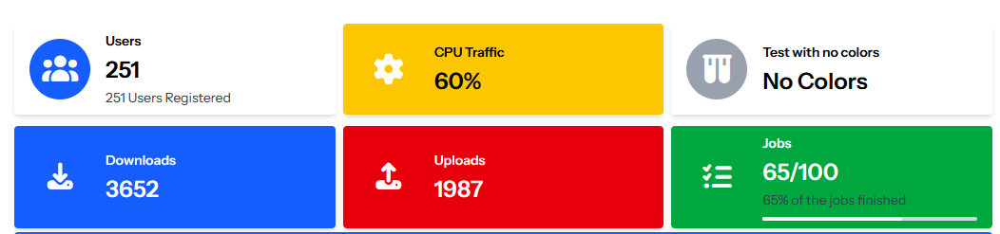
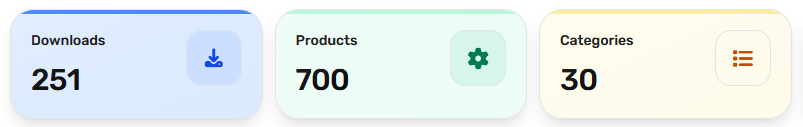

# 🧩 Widgets

## 📦 Card Widget
A reusable friendly Card component built with Tailwind CSS v4, part of the hawkiq/hwkui widget library. It supports theme colors, outline and solid styles, optional icons, header tools, footer, and dark mode.


###  Basic Usage

```html
    <x-hwkui-card title="Users" icon="fas fa-users" theme="primary">
        Basic Card Usage

        <x-slot name="tools">
            <button class="cursor-pointer text-white hover:text-gray-200">
                <i class="fas fa-plus"></i>
            </button>
            <button class="cursor-pointer text-white hover:text-gray-200">
                <i class="fas fa-cog"></i>
            </button>
        </x-slot>
        <x-slot name="footer">
            Card Footer
        </x-slot>
    </x-hwkui-card>


    <x-hwkui-card theme="danger" theme-mode="outline">
        A card without header has red border ...
    </x-hwkui-card>

    <x-hwkui-card icon="fas fa-cog" title="No theme-mode" theme="warning" disabled>
        A card with header using warning color but disabled...
    </x-hwkui-card>

    <x-hwkui-card icon="fas fa-cog" title="Full Theme Mode" theme="success" theme-mode="full">
        A card with full color...
    </x-hwkui-card>

```

## 📦 Info Box Widget
For display small infos with icons or progress bar


###  Basic Usage

```html
    <x-hwkui-info-box title="Users" text="251" icon="fas fa-users" iconTheme="primary"
        description="251 Users Registered" url="https://osama.app" urlTarget="_blank" />

    <x-hwkui-info-box title="CPU Traffic" text="60%" icon="fas fa-cog" theme="warning" iconTheme="warning" />

    <x-hwkui-info-box title="Test with no colors" text="No Colors" icon="fas fa-vials" />

    <x-hwkui-info-box title="Downloads" text="3652" icon="fas fa-download" theme="primary" iconTheme="primary" />

    <x-hwkui-info-box title="Uploads" text="1987" icon="fas fa-upload" theme="danger" iconTheme="danger" />

    <x-hwkui-info-box title="Jobs" text="65/100" description="65% of the jobs finished" icon="fas fa-tasks"
        theme="success" iconTheme="success" progress="65" />

```

## 📦 Small Box Widget
For display one info with beautiful UI


### Basic Usage

```html

<x-hwkui-small-box title="251" text="Users" icon="fas fa-users" theme="primary" url="https://osama.app"
            urlText="View all users" urlIcon="fas fa-link" />

        <x-hwkui-small-box title="Loading" text="Loading data..." icon="fas fa-tasks" theme="success"
            url="https://osama.app" urlText="More info" urlIcon="fas fa-link" loading="true" />

        <x-hwkui-small-box title="424" text="Views" icon="fas fa-eye" theme="danger"
            url="https://osama.app" urlText="View details" urlIcon="fas fa-link" />

        <x-hwkui-small-box title="Downloads" text="1205" icon="fas fa-download" />

```

## 📦 Glass Box Widget
For display small infos with icons with Glass look 


###  Basic Usage

```html
     <x-hwkui-glass-box title="Downloads" value="251" icon="fa-download" href="/admin"
            color="blue" />

        <x-hwkui-glass-box title="Products" :value="700" icon="fa-cog" href="/admin" color="emerald" />

        <x-hwkui-glass-box title="Categories" :value="30" icon="fa-list" href="/admin" color="amber" />

```
Supported colors names same as tailwind `(blue-amber-emerald-red-cyan-violet)`